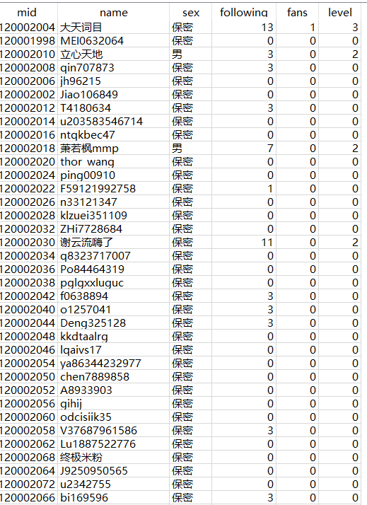

# bilibili-user-information-spider
# B站3亿用户信息爬虫（mid号，昵称，性别，关注，粉丝，等级）
  
## 相关文章:[B站视频信息爬虫](https://github.com/zhang0peter/bilibili-video-information-spider)  
之前写了B站视频信息的爬虫，然后就想到了爬取B站的用户信息。  </br>
在2018年3月11号，B站的第3亿用户诞生了。  </br>

## 准备工作
我使用的是Python3，数据库用的是Python自带的sqlite，使用requests库爬取。</br>
安装需要的库</br>

```python
pip install requests
```

本来我的打算是通过post来获取用户信息的，但发现这样做很容易被封。  </br>
在考虑良久后，我觉得通过用户的手机端页面来获取用户信息，这样不容易被封。  </br>
比如在手机上访问https://m.bilibili.com/space/2
这个页面，可以获取用户名，性别，等级的信息。  </br>
然后再通过api接口来获取用户的关注和粉丝数，如https://api.bilibili.com/x/relation/stat?jsonp=jsonp&vmid=2  </br>
```javascript
{
  "code":0,
  "data":{
          "mid":0,
          "following":116,
          "whisper":0,
          "black":0,
          "follower":327153},
  "message":"0",
  "ttl":1}
```
使用requests库获取数据，用concurrent.futures的多线程来加快爬取的速度，我采用的是10线程爬取。</br>


## 数据获取
B站对爬虫采取的是一旦发现，就封ip一天到5天不等。</br>
但是如果使用代理，爬取总共数量3亿的用户信息需要花费非常多的时间。</br>
我用过的最好的代理能一小时获取5万条用户信息，这样算下来需要**6000小时**才能爬完所有信息！  </br>
在累计爬到一亿多时，我发现我的ip被封的很频繁，于是就不再爬下去了，因为这3亿用户有太多的僵尸用户了。  </br>
比如:  </br>
  </br>
从图上可以看出这一面的用户基本都是僵尸用户，除了少数几个有等级或者关注的。  </br>
应该是16年B站开放注册后僵尸用户一下子就多起来了。  </br>
我就不把自己爬到的全部数据放上来了,就前**109万**用户的数据放上来，在data.db里。  </br>


爬虫代码见 [bilibili-user-information-spider.py](code.py)</br>
参考资料： [bili-user](https://github.com/airingursb/bilibili-user/)</br>
